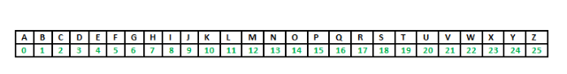
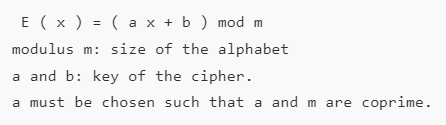

## Implementasi Affine Cipher </p>
Affine Cipher adalah jenis cipher substitusi monoalphabetic, di mana setiap huruf dalam alfabet dipetakan ke padanan numeriknya, dienkripsi menggunakan fungsi matematika sederhana, dan dikonversi kembali menjadi huruf. Rumus yang digunakan berarti bahwa setiap huruf dienkripsi ke satu huruf lainnya, dan kembali lagi, artinya cipher pada dasarnya adalah cipher substitusi standar dengan aturan yang mengatur huruf mana yang dituju. </p>
Seluruh proses bergantung pada kerja modulo m (panjang alfabet yang digunakan). Dalam sandi affine, huruf-huruf alfabet berukuran m pertama-tama dipetakan ke bilangan bulat dalam rentang <b> 0 … m-1. </b></p>

<b> 'Kunci' </b> untuk cipher Affine terdiri dari 2 angka, kami akan menyebutnya a dan b. Pembahasan berikut mengasumsikan penggunaan alfabet <b> 26 karakter (m = 26). </b> a harus dipilih agar relatif prima terhadap m (yaitu a seharusnya tidak memiliki faktor yang sama dengan m). </p>

</p>

## Encryption </p>

Encryption menggunakan aritmatika modular untuk mengubah bilangan bulat yang setiap huruf plaintext berkorespondensi menjadi bilangan bulat lain yang sesuai dengan huruf ciphertext. Fungsi enkripsi untuk satu huruf adalah </p>

 </p>

## Decryption </p>
Dalam descryption ciphertext, kita harus melakukan fungsi kebalikan (atau invers) pada ciphertext untuk mengambil plaintext. Sekali lagi, langkah pertama adalah mengubah setiap huruf ciphertext menjadi nilai integernya. Fungsi dekripsi adalah </p>

```
D ( x ) = a^-1 ( x - b ) mod m
a^-1 : modular multiplicative inverse of a modulo m. i.e., it satisfies the equation
1 = a a^-1 mod m .

```
</p>

